# BD-all-cnpj-Brasil-and-insights-leads-ML

Plataforma Django para importar, organizar e analisar dados públicos de empresas brasileiras, relacionar empresas, CNAEs e sócios, apoiar a prospecção comercial e futuramente gerar insights com Machine Learning.

O projeto combina Django ORM, SQL, ETL em lotes, administração Django e integrações externas autorizadas. Toda fonte externa deve ser usada de acordo com sua API, termos de uso, limites de requisição, política de privacidade e regras aplicáveis de `robots.txt`.

## Status atual

### Concluído ou validado

- Projeto Django inicial funcionando.
- Modelos `Company`, `CNAE` e `Partner`.
- Migrations iniciais.
- Índices para consultas por estado e cidade.
- Importação em lotes com `bulk_create` e `transaction.atomic()`.
- Contador de progresso e commit do lote final corrigidos.
- Layout do arquivo de Estabelecimentos identificado: CSV sem cabeçalho, delimitador `;`, encoding `latin1` e 30 colunas.
- CNPJ completo identificado como `cnpj_basico + ordem + dv`.
- Datas do arquivo identificadas no formato `YYYYMMDD`.
- Consulta indexada por estado validada no Django Shell.

### Em andamento

- Importação completa dos arquivos de Estabelecimentos.
- Enriquecimento com arquivos de Empresas por `cnpj_basico`.
- Mapeamento de códigos de Municípios para nomes.
- Relatório de qualidade e proveniência dos dados.

### Planejado

- Filtros determinísticos de leads.
- Administração Django orientada à operação de dados.
- Integrações com APIs externas autorizadas.
- Pipeline de Machine Learning para perguntas empresariais.
- Insights explicáveis, monitoramento, CI/CD e implantação de produção.

## Dados e arquitetura atual

A base oficial da Receita Federal contém arquivos de grande volume, incluindo Empresas, Estabelecimentos, Sócios, Municípios e tabelas de referência. Os arquivos brutos devem permanecer versionados por origem, período e checksum quando possível, mas não devem ser carregados integralmente na memória nem armazenados no Git.

O modelo atual contém:

- `Company`: CNPJ, razão social, nome fantasia, data de abertura, situação cadastral, capital social, natureza jurídica, endereço, cidade, estado, CEP, telefone, email e site.
- `CNAE`: código e descrição da atividade econômica.
- `Partner`: sócio, empresa e qualificação.

As relações principais são:

- `Company.cnae_main`: atividade principal.
- `Company.cnae_secondary`: atividades secundárias.
- `Partner.company`: relação entre sócio e empresa.

SQLite é adequado para desenvolvimento e validação inicial. A escolha de banco para produção será feita após medir volume, concorrência, consultas, custo e operação. NoSQL é uma possibilidade futura, não um requisito atual.

## Requisitos formais

A documentação usa três níveis de requisitos:

- **URS**: necessidades e resultados esperados pelos usuários.
- **BusinessRS**: objetivos, regras e métricas do negócio.
- **SystemRS/SRS**: comportamento técnico necessário para atender aos requisitos de usuário e negócio.

Cada requisito deve possuir identificador, prioridade, origem, dependências, critério de aceite, teste relacionado e status.

### URS: requisitos de usuário

- **URS-001**: pesquisar empresas por CNPJ, razão social, nome fantasia, estado, cidade ou CNAE.
- **URS-002**: filtrar potenciais leads por segmento, localização, situação, capital e tempo de mercado.
- **URS-003**: visualizar dados cadastrais, atividades, endereço, origem e data de atualização.
- **URS-004**: visualizar relações entre empresas, CNAEs e sócios quando autorizado.
- **URS-005**: administrar dados pelo Django Admin com autenticação e permissões.
- **URS-006**: executar importações oficiais ou autorizadas e acompanhar sucesso, falhas e quantidade processada.
- **URS-007**: consultar insights empresariais com origem, limitações e confiança quando aplicável.
- **URS-008**: exportar resultados somente para usuários autorizados.
- **URS-009**: identificar dados ausentes, duplicados, inválidos ou desatualizados.
- **URS-010**: controlar acesso por usuário, grupo e permissão.

### BusinessRS: negócio

- **BusinessRS-001**: reduzir o tempo para encontrar empresas compatíveis com um perfil comercial.
- **BusinessRS-002**: melhorar a qualidade dos leads priorizados.
- **BusinessRS-003**: apoiar decisões com dados públicos e autorizados.
- **BusinessRS-004**: preservar confiabilidade, origem e atualidade dos dados.
- **BusinessRS-005**: reduzir custos sem comprometer qualidade, explicabilidade ou desempenho.
- **BusinessRS-010**: um CNPJ válido identifica uma única empresa na base principal.
- **BusinessRS-011**: CNPJ, UF, CNAE, datas e valores devem ser validados antes das análises.
- **BusinessRS-012**: dados externos devem registrar fonte e data de coleta.
- **BusinessRS-013**: dados antigos devem exibir sua data de referência.
- **BusinessRS-014**: a qualificação de lead deve ser baseada em regras ou modelo documentado.
- **BusinessRS-015**: a definição de lead quente depende de critérios comerciais aprovados.
- **BusinessRS-016**: capital social é indicador de segmentação, não prova isolada de interesse.
- **BusinessRS-017**: tempo de mercado é calculado a partir da data de abertura válida.
- **BusinessRS-018**: empresas inativas devem ser identificadas e tratadas segundo regra comercial.
- **BusinessRS-019**: dados pessoais devem ser minimizados, protegidos e usados com finalidade definida.
- **BusinessRS-020**: APIs e fontes externas exigem autorização e respeito aos seus termos.
- **BusinessRS-022**: classificações e recomendações devem informar fatores relevantes quando houver ML.
- **BusinessRS-023**: decisões ainda não aprovadas permanecem como `Pendente de decisão`.

Métricas previstas: taxa de leads qualificados, conversão, retenção, tempo de prospecção, cobertura, atualização, precisão e custo por enriquecimento.

### SystemRS/SRS: sistema

- **SystemRS-001 a 003**: armazenar empresas, CNAEs, sócios e seus relacionamentos com chaves e restrições consistentes.
- **SystemRS-004**: importar arquivos em lotes transacionais.
- **SystemRS-005**: permitir reexecução idempotente sem duplicar registros válidos.
- **SystemRS-006**: validar campos, formatos, datas, chaves e relacionamentos.
- **SystemRS-007**: oferecer consultas e filtros indexados.
- **SystemRS-008**: paginar consultas grandes.
- **SystemRS-009**: oferecer administração, busca, filtros e edição controlada.
- **SystemRS-010**: aplicar autenticação, grupos e permissões.
- **SystemRS-011**: isolar integrações externas com timeout, retry, rate limit, cache e logs.
- **SystemRS-012**: preservar proveniência e status de integrações.
- **SystemRS-013**: separar dados brutos, tratados, relacionados e features.
- **SystemRS-014**: permitir preparação, avaliação e versionamento de modelos.
- **SystemRS-015**: apresentar explicações e limitações dos resultados.
- **SystemRS-016**: registrar operações administrativas relevantes.
- **SystemRS-020 a 030**: atender segurança, segredos, desempenho, escalabilidade, disponibilidade, observabilidade, backup, privacidade, manutenibilidade e compatibilidade.

## SDLC do projeto

O ciclo é incremental: cada fase produz artefatos e evidências que alimentam a seguinte, mas resultados de qualidade, testes ou produção podem devolver o trabalho a uma fase anterior.

### 1. Requisitos e análise

**Objetivo:** definir usuários, problema, escopo, regras e critérios de sucesso.

**Atividades:**

- manter URS, BusinessRS e SystemRS rastreáveis;
- definir as perguntas empresariais prioritárias;
- separar MVP, funcionalidades futuras e fora de escopo;
- registrar requisitos de segurança, privacidade, desempenho e escalabilidade;
- documentar fontes oficiais, limites e permissões.

**Saídas:** requisitos aprovados, matriz de rastreabilidade, riscos, prioridades e critérios de aceite.

**Critério de saída:** cada requisito prioritário possui responsável, dependências e evidência planejada.

### 2. Design e arquitetura

**Objetivo:** transformar requisitos em um desenho implementável.

**Arquitetura inicial:** Django monolítico modular com camadas de ingestão/ETL, domínio ORM, enriquecimento, consultas, administração e ML.

**Atividades:**

- revisar `Company`, `CNAE` e `Partner` após conhecer todos os layouts;
- definir chaves, índices, cardinalidades e normalização;
- escolher armazenamento de desenvolvimento e produção;
- documentar trade-offs entre desempenho, custo e simplicidade;
- definir proveniência, auditoria e fronteiras de dados;
- produzir diagramas e pseudocódigo quando necessário.

**Saídas:** documento de arquitetura, modelo de dados, decisões técnicas e plano de migrações.

**Critério de saída:** o desenho atende aos requisitos prioritários e possui riscos conhecidos.

### 3. Implementação

**Objetivo:** construir o sistema conforme os requisitos e a arquitetura.

**Padrões:**

- PEP 8;
- `ruff`, `black` ou `pylint`;
- testes Django;
- comandos de gerenciamento reexecutáveis;
- batches e transações para cargas grandes;
- logs sem PII desnecessária;
- documentação contínua;
- serviços isolados para APIs;
- segredos fora do código.

**Implementação de ETL:**

1. ler arquivos sem cabeçalho com delimitador `;` e encoding `latin1`;
2. validar as 30 colunas de Estabelecimentos;
3. montar o CNPJ com `cnpj_basico + ordem + dv`;
4. converter datas `YYYYMMDD`;
5. importar em lotes de 5.000;
6. usar `bulk_create` e `transaction.atomic()`;
7. executar o commit final fora do loop;
8. registrar progresso, erros e contagens;
9. enriquecer com Empresas por `cnpj_basico`;
10. mapear Municípios por código oficial.

**Critério de saída:** o código possui teste, revisão e evidência de execução para o requisito implementado.

### 4. Testes e verificação

**Objetivo:** provar que o sistema atende aos requisitos e não regrediu.

**Testes previstos:**

- modelos, constraints e migrations;
- unicidade do CNPJ e relações ORM;
- parser de amostra;
- encoding, delimitador e número de colunas;
- datas, CNPJs, duplicidades e campos inválidos;
- importação em lote, retomada e rollback;
- filtros, paginação e views;
- Django Admin, autenticação e permissões;
- contratos de APIs externas com mocks;
- rate limiting e proveniência;
- qualidade dos dados;
- regressão;
- integração ETL;
- prevenção contra data leakage;
- avaliação de modelo;
- smoke test e UAT.

Comandos iniciais:

```bash
python manage.py check
python manage.py test
```

**Critério de saída:** testes prioritários passam e cada requisito implementado possui evidência.

### 5. Implantação

**Objetivo:** publicar versões reproduzíveis com risco controlado.

**Desenvolvimento:** `runserver`, SQLite e dados de teste.

**Homologação:** banco separado, dados controlados, testes de integração e validação de migrations.

**Produção:** servidor WSGI/ASGI apropriado, banco relacional adequado, HTTPS, variáveis protegidas, backups e monitoramento. `runserver` não é servidor de produção.

**Releases:**

- Alpha para validação inicial com stakeholders;
- staging/homologação para validação técnica;
- release estável após aprovação;
- rollback por versão, migration e backup quando necessário.

**Critério de saída:** checklist pré-deploy aprovado, backup disponível e validação pós-deploy concluída.

### 6. Manutenção e operação

**Objetivo:** manter qualidade, segurança, desempenho e utilidade do sistema.

**Métricas:**

- tempo e quantidade de registros por importação;
- erros, duplicidades e campos ausentes;
- idade e cobertura dos dados;
- falhas e custo de APIs;
- tempo de resposta;
- armazenamento;
- desempenho e drift do modelo;
- conversão de leads.

**Atividades:**

- alertas por severidade;
- backup e teste de restauração;
- correção de bugs e incidentes;
- atualização de dependências;
- revisão de segurança e custos;
- reprocessamento de dados;
- retreinamento e revisão do modelo;
- revisão periódica dos requisitos.

**Critério de saída:** incidentes têm registro, responsável, ação corretiva e validação.

## Pipeline ETL e qualidade

O fluxo de dados é:

```mermaid
flowchart LR
    A[Arquivos oficiais] --> B[Leitura controlada]
    B --> C[Validação e limpeza]
    C --> D[Estabelecimentos]
    D --> E[Empresas por cnpj_basico]
    E --> F[Municipios por codigo]
    F --> G[ORM relacional]
    G --> H[Relatorio de qualidade]
    H --> I[Filtros e features]
```



### Próximos marcos de ingestão

1. testar Estabelecimentos em uma amostra;
2. conferir parsing, CNPJ, datas e contagens;
3. executar a carga grande e registrar `FINAL X`;
4. importar Empresas por `cnpj_basico`;
5. carregar Municípios e validar códigos sem correspondência;
6. produzir relatório de nulos, duplicidades e inconsistências;
7. revisar o modelo e os índices com base nos três layouts.

A ingestão não deve carregar 6 GB na RAM. Arquivos brutos devem permanecer fora do Git e ter origem, período, versão e checksum registrados quando possível.

## Leads e Machine Learning

Antes do ML, serão implementados filtros determinísticos por CNAE, UF, cidade, situação cadastral, capital, idade, contatos e número de estabelecimentos. Cada resultado deverá mostrar os critérios utilizados.

O pipeline de ML será iniciado somente quando houver uma pergunta, variável-alvo e histórico confiável. O fluxo será:

1. definir a pergunta empresarial;
2. coletar e rotular dados;
3. preparar dados e features;
4. dividir treino e teste, preferencialmente respeitando o tempo;
5. criar baseline;
6. treinar e avaliar;
7. verificar data leakage;
8. explicar resultados;
9. publicar modelo versionado;
10. monitorar desempenho e drift;
11. retornar à preparação quando necessário.

Sem histórico real de conversão, o sistema pode fazer segmentação e ranking por regras, mas não deve afirmar que prevê conversão.

## Git, branches, CI e CD

Essas atividades ocorrem em paralelo às seis fases do SDLC.

### Controle de versão

- usar Git para registrar alterações;
- criar commits pequenos e descritivos;
- nunca versionar banco local, arquivos brutos, `.env`, chaves ou tokens;
- usar tags para releases;
- conferir `git diff` antes do commit.

Comandos básicos:

```bash
git status
git diff
git add README.md
git commit -m "docs: organize SDLC do projeto"
git push
```

### Branches e pull requests

- `main`: versão revisada e protegida;
- `feature/<nome>`: novas funcionalidades;
- `fix/<nome>`: correções;
- pull request obrigatório antes do merge;
- revisão dos requisitos, testes e riscos antes da integração.

### Integração contínua (CI)

A cada pull request, executar no mínimo:

```bash
python manage.py check
python manage.py test
```

A CI deverá evoluir para incluir lint, validação de migrations, testes de importação com fixtures pequenas, verificação de segurança e validação de Markdown. Falhas devem bloquear o merge até correção ou justificativa registrada.

### Entrega contínua (CD)

O CD será configurado depois da escolha do ambiente de produção. O fluxo previsto é:

1. validar a branch;
2. executar CI;
3. criar artefato ou release;
4. publicar em homologação;
5. executar smoke test;
6. aprovar produção;
7. criar backup;
8. aplicar migrations controladas;
9. publicar;
10. validar logs e saúde;
11. executar rollback se necessário.

## Segurança, privacidade e fontes externas

- Django não substitui configuração segura, autorização e testes.
- Segredos devem usar `.env` local e Secret Manager ou variáveis protegidas em produção.
- Dados pessoais devem ser minimizados, protegidos e retidos pelo tempo necessário.
- APIs devem usar clientes isolados, timeout, retry controlado, cache e rate limit.
- Google Maps, redes sociais e outras fontes só serão integrados com autorização e termos compatíveis.
- `robots.txt` e políticas de uso devem ser consultados quando aplicáveis.
- Toda fonte persistida deve registrar origem e data de coleta.

## Roadmap

1. Fechar importação de Estabelecimentos.
2. Integrar Empresas.
3. Integrar Municípios.
4. Criar relatório de qualidade.
5. Implementar filtros de leads.
6. Melhorar Django Admin e permissões.
7. Criar integrações externas autorizadas.
8. Definir pergunta e dataset para ML.
9. Implementar baseline e avaliação.
10. Configurar CI/CD e homologação.
11. Planejar produção, monitoramento e operação.

## Referências do processo

- [ESTRUTURA-ENGENHARIA-CONTEXTO](ESTRUTURA-ENGENHARIA-CONTEXTO/README.md)
- [SDLC de engenharia de contexto](ESTRUTURA-ENGENHARIA-CONTEXTO/SDLC.md)
- [Documentação oficial do CNPJ](https://dados.gov.br/dados/conjuntos-dados/cadastro-nacional-da-pessoa-juridica---cnpj)
- [GitHub Copilot Best Practices](https://docs.github.com/en/enterprise-cloud@latest/copilot/tutorials/coding-agent/get-the-best-results)

## Status dos requisitos

- `Concluído`: existe código e evidência verificada.
- `Em andamento`: implementação iniciada.
- `Pendente de validação`: precisa de teste ou confirmação.
- `Pendente de decisão`: depende de regra de negócio ou escolha técnica.
- `Fora do escopo`: não será tratado na entrega atual.
